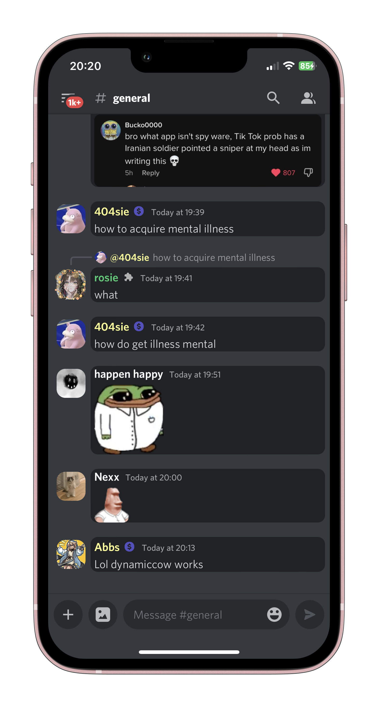
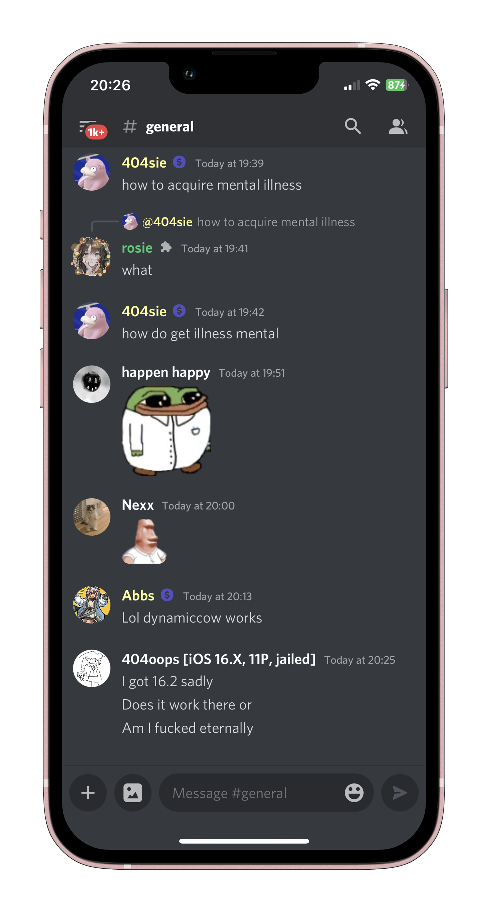
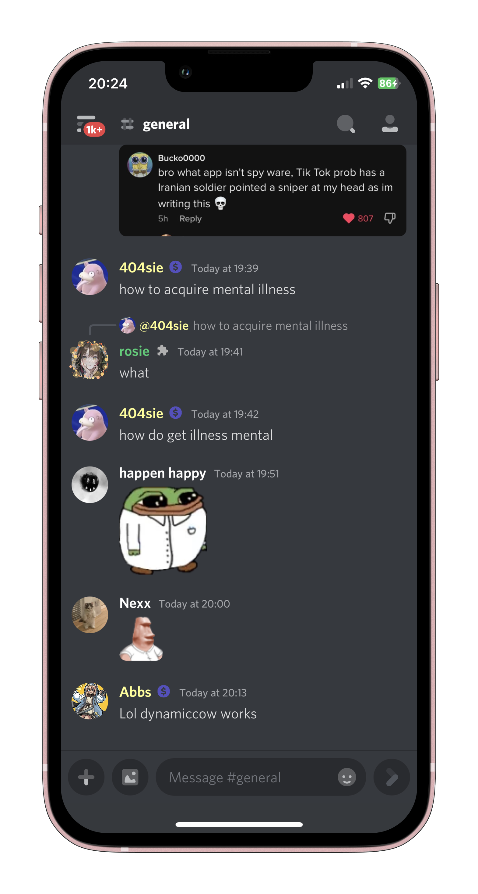
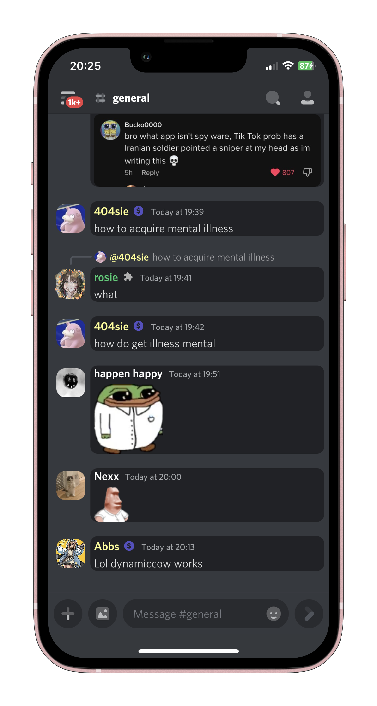
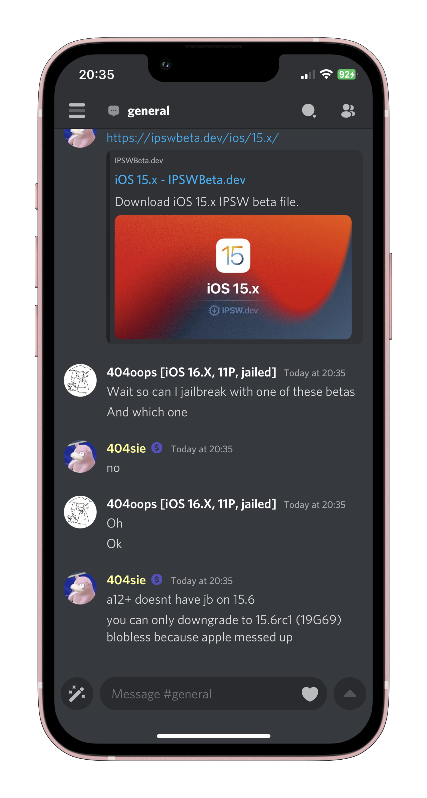
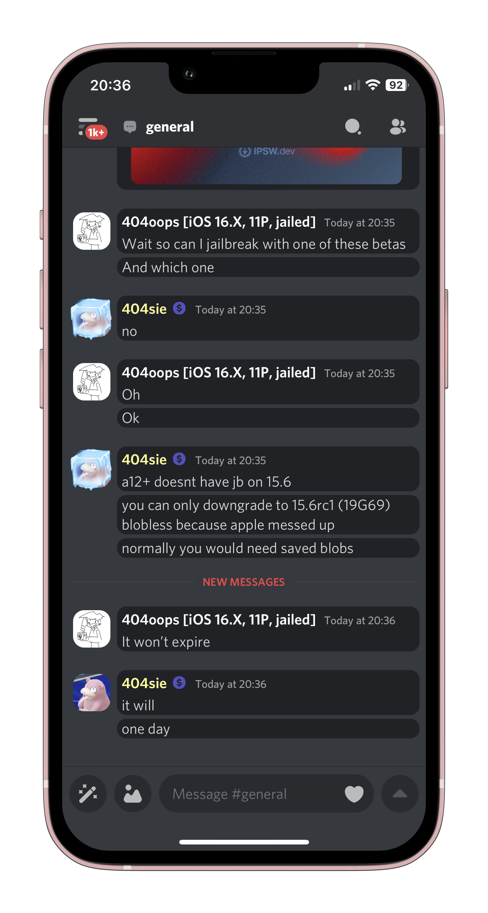

# AltStore-Rosiecord

## Rosiecord but it works with AltStore and SideStore :scream:

## The original Rosiecord repo can be found [here](https://github.com/acquitelol/rosiecord) ##

### How to install

The AltStore sources can be found [here](https://github.com/YangTheParrot/AltStore-Rosiecord/blob/main/Sources/_sources.md) (BETA)

The [Releases](https://github.com/YangTheParrot/AltStore-Rosiecord/releases/) tab has all of the IPAs that you can install. Sideload the IPA normally, as if you were sideloading Enmity.

**This version of Rosiecord uses Stable Discord IPAs, which means they should be more stable and will work with AltStore**

### The IPAs may seem confusing and cluttered

People wanted variations for each IPA, so here is what each IPA means and how the naming convention works:

AltStore-Rosiecord_[[FontName]](https://github.com/YangTheParrot/AltStore-Rosiecord/tree/master/Fonts/woff2)-Font+[[IconPack]](https://github.com/YangTheParrot/AltStore-Rosiecord/tree/master/Packs)_Pack([[+Flowercord]](https://github.com/YangTheParrot/AltStore-Rosiecord/tree/main/Tweaks/Flowercord)).ipa

                       ^^^ Font used    ^^^ Icon pack used

## You can look at the IPA names in [Releases](https://github.com/YangTheParrot/AltStore-Rosiecord/releases/), and choose the best one to fit your needs

### What is [Flowercord](https://github.com/YangTheParrot/AltStore-Rosiecord/tree/main/Tweaks/Flowercord)?

#### [Flowercord](https://github.com/YangTheParrot/AltStore-Rosiecord/tree/main/Tweaks/Flowercord) is an optional tweak injected into the Rosiecord IPA

#### It adds chat bubbles to messages and makes profile pictures in the chat area square. The following is a screenshot showing this

### Icon Pack Screenshots

#### This section highlights what each [icon pack](https://github.com/YangTheParrot/AltStore-Rosiecord/tree/master/Packs/) looks like with and without [Flowercord](https://github.com/YangTheParrot/AltStore-Rosiecord/tree/main/Tweaks/Flowercord)

#### Of course, these screenshots will vary depending on the font and theme you use. The screenshots are simply meant to show what the [icon packs](https://github.com/YangTheParrot/AltStore-Rosiecord/tree/master/Packs/) look like

## Default - [Install](https://github.com/YangTheParrot/AltStore-Rosiecord/releases/latest)

(The default normie look)

  
  

## [Plumpy](https://github.com/YangTheParrot/AltStore-Rosiecord/tree/master/Packs/Plumpy) - [Install](https://github.com/YangTheParrot/AltStore-Rosiecord/releases/latest)

(Probably the most liked pack, constantly updated with new icons by another Rosie :3)

  
  

## [Iconsax](https://github.com/YangTheParrot/AltStore-Rosiecord/tree/master/Packs/Iconsax) - [Install](https://github.com/YangTheParrot/AltStore-Rosiecord/releases/latest)

(Uses some icons from Plumpy, given by Flower :3, includes quite modern icons.)

  
  

Created with <3 By **Rosie** in TypeScript :3

Edited by **mhm balls!** :skull:

This project simply wraps the [Enmity](https://github.com/enmity-mod/enmity) Project with a new patcher and extra features ~ Show them some love!
# AltStore-Rosiecord